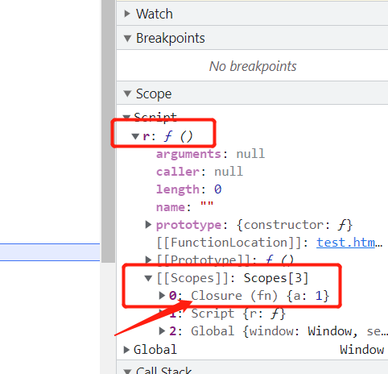

```html
<!DOCTYPE html>
<html lang="en">
<head>
    <meta charset="UTF-8">
    <meta http-equiv="X-UA-Compatible" content="IE=edge">
    <meta name="viewport" content="width=device-width, initial-scale=1.0">
    <title>Document</title>
</head>
<body>
    <script>
        function fn() {
            let a =1;
            return function() {
                console.log(a);
            }
        }
        let r = fn();
        debugger;
        r();
    </script>
</body>
</html>
```

- 执行上述代码

- 在浏览器中查看

